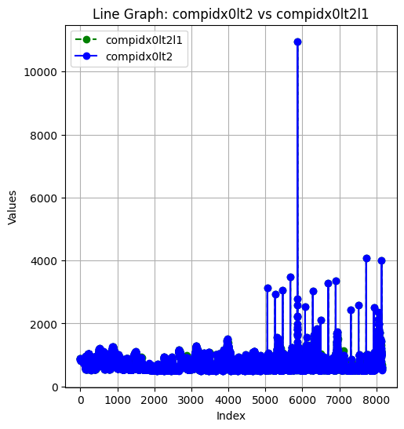

## Pendahuluan ✨✨✨

Proyek ini bertujuan untuk membangun model neural network multi-output regression untuk memprediksi beberapa target variabel secara simultan. Proses pengolahan data meliputi seleksi fitur, reduksi dimensi, dan pelatihan model dengan GPU. Model ini menggunakan arsitektur neural network sederhana yang dirancang untuk menangani masalah regresi dengan output multi-target.

---

## Proses Pengolahan Data 🌟🌟🌟

### 1. **Drop Kolom dengan P-Value > 0.05**

Proses awal melibatkan penghapusan kolom yang distribusinya dianggap mirip dengan kolom lain. Kolom-kolom ini diidentifikasi menggunakan statistik Kolmogorov-Smirnov Test (ks\_2samp). Kolom dengan P-Value > 0.05 dihapus untuk mengurangi redundansi dalam data. Contoh data bersifat redundant

### 2. **Seleksi Fitur dengan Feature Importance**

Setelah preprocessing awal, dilakukan seleksi fitur menggunakan algoritma Random Forest Regressor. Dari hasil seleksi, hanya 25 fitur teratas yang dipilih berdasarkan nilai **feature importance**.

### 3. **Reduksi Dimensi dengan PCA (Principal Component Analysis)**

Principal Component Analysis (PCA) digunakan untuk mereduksi dimensi data sambil mempertahankan 95% dari variansi total dalam dataset. Komponen PCA yang dihasilkan digunakan sebagai input untuk model neural network.

---

## Arsitektur Model Neural Network 🤖🤖🤖

Model neural network yang digunakan adalah model **Multi-Output Regression Neural Network** dengan arsitektur sebagai berikut:

- **Layer 1**: Fully Connected Layer dengan 128 neuron dan fungsi aktivasi ReLU.
- **Layer 2**: Fully Connected Layer dengan 64 neuron dan fungsi aktivasi ReLU.
- **Layer 3**: Fully Connected Layer dengan jumlah neuron sesuai jumlah target output.
## Kenapa Memilih Neural Network?
Kemampuan Menangani Data Besar dan Kompleks
Neural networks sangat efektif untuk menangani data dalam jumlah besar dengan struktur yang kompleks. Dalam proyek ini, dataset yang digunakan sangat besar dan penuh dengan pola yang tidak linear, sehingga metode tradisional seperti regresi linear atau pohon keputusan tidak cukup untuk menangkap hubungan antar variabel dengan akurat. Neural networks mampu belajar dari data secara mendalam dan menemukan pola yang kompleks dalam data yang tidak bisa ditemukan dengan metode lainnya.

Kemampuan untuk Belajar Secara Otomatis dari Data
Salah satu keunggulan utama neural network adalah kemampuannya untuk mengekstrak fitur secara otomatis dari data mentah. Ini sangat mengurangi kebutuhan akan rekayasa fitur manual yang sering kali diperlukan dengan metode lain. Dengan NN, model belajar langsung dari data tanpa perlu pengaturan fitur yang rumit, yang sangat menguntungkan untuk aplikasi yang melibatkan data besar dan tak terstruktur.

Peningkatan Kinerja dengan GPU
Neural networks membutuhkan banyak komputasi, terutama untuk data besar. GPU (Graphics Processing Unit) memungkinkan pemrosesan paralel yang jauh lebih efisien, sehingga waktu pelatihan dapat dipersingkat secara signifikan. Dengan GPU, proses perhitungan dapat dilakukan dalam waktu yang lebih cepat dibandingkan dengan menggunakan CPU, yang sangat penting ketika bekerja dengan dataset yang besar dan kompleks. GPU mendukung pengolahan data dalam jumlah besar secara lebih cepat dan efisien, memungkinkan eksperimen lebih banyak dalam waktu yang terbatas.

---

## Pelatihan Model 🚀🚀🚀

### 1. **Konfigurasi Training**

- **Input Size**: Berdasarkan jumlah komponen PCA yang dipertahankan.
- **Output Size**: 16 target variabel (LBL, MTLp2 – MTLp16).
- **Loss Function**: Mean Squared Error (MSE).
- **Optimizer**: Adam Optimizer dengan learning rate 0.001.
- **Runtime**: Model dilatih menggunakan GPU dengan runtime sekitar 5 menit.
- **Epoch**: Epoch ada berada di 100.000

### 2. **Hasil Pelatihan**

Model dievaluasi menggunakan metrik **Root Mean Squared Error (RMSE)** untuk setiap target variabel. RMSE memberikan interpretasi langsung dalam satuan yang sama dengan target.

#### Hasil Evaluasi Model

| Target | MSE       | RMSE   |
| ------ | --------- | ------ |
| LBL    | 10,678.09 | 103.32 |
| MTLp2  | 11,562.65 | 107.57 |
| MTLp3  | 15,835.68 | 125.87 |
| MTLp4  | 18,809.50 | 137.16 |
| MTLp5  | 35,377.08 | 188.04 |
| MTLp6  | 49,554.80 | 222.53 |
| MTLp7  | 43,077.36 | 207.50 |
| MTLp8  | 59,750.00 | 244.47 |
| MTLp9  | 11,394.02 | 106.80 |
| MTLp10 | 15,544.88 | 124.64 |
| MTLp11 | 13,499.52 | 116.17 |
| MTLp12 | 18,034.25 | 134.31 |
| MTLp13 | 17,858.15 | 133.60 |
| MTLp14 | 18,638.80 | 136.51 |
| MTLp15 | 17,516.15 | 132.33 |
| MTLp16 | 19,995.49 | 141.41 |

**Average RMSE**: 140.01
Dengan menggunakan RMSE, kita mendapatkan angka yang lebih mudah dipahami dalam konteks evaluasi model. Misalnya, jika RMSE adalah 103.32, itu berarti model secara rata-rata memiliki kesalahan sekitar 103.32 unit dari target yang diprediksi, dan ini lebih mudah dimengerti daripada MSE yang memiliki satuan yang tidak langsung terkait dengan data.

## Hasil Deployment
https://manufacturing-data-m-ljdryum3eqkxw5is8boytc.streamlit.app/
